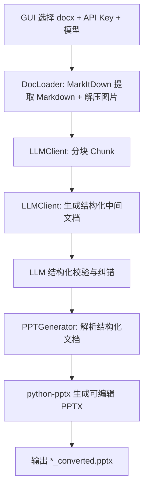

# 角色设定
你是一个具有顶级架构思维的 Python 全栈工程师，精通自动化办公、大模型工作流（LLM Workflow）构建以及现代前端/文档渲染技术。

# 项目背景与痛点
我们需要开发一个 Windows 桌面应用（GUI），将教师上传的试卷（.docx，可能包含复杂排版、浮动图片）转换为优美排版的教学 PPT（.pptx）。
之前的方案使用了 `python-docx` 和 `python-pptx`，遇到了无法克服的瓶颈：
1. 无法稳定提取浮动图片。
2. LLM 输出 JSON 不稳定，极易导致长段落“吞字”、漏题。
3. `python-pptx` 算坐标排版极丑，且长文本经常溢出屏幕。

# 全新架构设计 (The New Workflow)
为了彻底解决上述问题，我们现在采用**“Markdown 原生工作流”**进行全面重构。流程如下：
1. **Input**: 使用微软开源的 `markitdown` 库，将 Word 完美解析为结构化 Markdown 文本，并用原生 Zip 解压法保底提取图片。
2. **Brain**: 调用 DeepSeek API，输入原始 Markdown，要求其输出符合 **Marp 语法**（一种用于生成幻灯片的 Markdown 扩展）的 MD 字符串。
3. **Output**: 调用独立的 `Marp CLI` 可执行文件，一键将 Marp MD 转换为美观的自适应 `.pptx`。

# 核心依赖与环境配置 (Dependencies)
请在代码开头或者 `requirements.txt` 中引入以下依赖：
- `customtkinter` (用于现代化 GUI 界面)
- `markitdown` (微软官方库 `pip install markitdown`，用于解析 docx)
- `openai` (用于调用 DeepSeek API)
- `requests` (用于下载 Marp CLI 独立程序)
- 原生内置库：`zipfile`, `subprocess`, `threading`, `os`, `re`

# 核心开发任务与逻辑拆解

## 步骤 1：构建前置准备 (Marp CLI 下载器)
由于项目最终需要打包成无需环境的独立 `.exe`，我们不能依赖用户的 Node.js 环境。
- **任务**：在 `utils/marp_manager.py` 中写一个函数。程序启动时检测本地是否有 `marp.exe`（Windows 独立版二进制文件）。如果没有，自动从 GitHub Releases (https://github.com/marp-team/marp-cli/releases/latest) 下载对应的压缩包并解压出可执行文件。

## 步骤 2：现代化的文档解析 (doc_loader.py)
- **文字提取**：直接使用 `from markitdown import MarkItDown`，调用 `MarkItDown().convert(file_path).text_content` 获取极为干净的 Markdown 文本。
- **图片提取保底**：由于试卷图片非常关键，保留使用 `zipfile` 解压 `.docx` 到 `temp_images/` 目录的逻辑。并通过正则或文件名顺序，将图片名嵌入到提取出的 Markdown 文本末尾，供 LLM 参考。

## 步骤 3：基于 Chunk 的 Marp 生成 (llm_client.py)
这是项目的灵魂！LLM 不再输出容易格式错误的 JSON，而是直接输出 **Marp Markdown**。
- **切片逻辑 (Chunking)**：试卷可能长达几万字，超出 LLM 输出限制。请编写代码，按“大题标题”（如 `## 一、选择题`）将 MarkItDown 输出的文本切分成多个 Chunk。
- **系统提示词 (System Prompt) 严格要求**：
  """
  你是一个幻灯片排版专家。请将用户输入的试卷内容，重写为符合 Marp 语法的 Markdown 代码。
  规则：
  1. 使用 `---` 分隔每一页幻灯片。
  2. 每道题目必须分为两页：第一页只展示题干和选项；第二页展示完整的“题目 + 答案 + 解析”。
  3. 如果遇到长文本阅读材料（背景材料），单独放在一页或多页（使用 `---` 切分），不要把它和题目挤在一起。
  4. 如果提供的文本中提到图片（如 [image1.png]），请使用 Marp 的图片排版语法，如 ``，让图文并排显示。
  5. 严禁漏题！严禁总结缩写！必须100%保留原文的每一个字。
  6. 不要输出任何非 Marp 代码的解释性文字。
  """

## 步骤 4：PPTX 极速渲染 (ppt_generator.py)
- **任务**：将 LLM 返回的所有 Marp MD 字符串拼接起来。在文件头部加入 Marp 的 Front-matter（如 `theme: default`, `size: 16:9`, `paginate: true`）。
- 将完整的 MD 写入本地 `temp.md`。
- **调用命令行**：使用 `subprocess.run(["marp.exe", "temp.md", "--pptx", "-o", output_file_path])`。
- Marp 会自动处理字号自适应、排版和对齐，生成完美的 PPTX。

## 步骤 5：GUI 与体验 (main.py)
- 使用 `customtkinter` 提供界面。包含：API Key 输入、模型选择（DeepSeek）、文件选择、转换文件输出、日志实时打印框，还有终端当前操作按钮避免错误操作一直卡死。
- 所有的解析、API 请求和 subprocess 调用必须在**子线程**中运行，绝对不能卡死主界面。
- 增加容错：如果 API 失败重试 3 次；如果用户点击“终止”，利用 `threading.Event()` 安全退出。

# 开始执行
请先向我确认你理解了这个全新的架构优势。然后，请按顺序给我提供：
1. `requirements.txt`
2. 目录结构树
3. `utils/marp_manager.py` 的代码
4. `core/doc_loader.py` (结合 MarkItDown) 的代码

# 运行环境
上述所有开发内容必须在虚拟环境下进行：conda activate Chen

# 当前流程图

